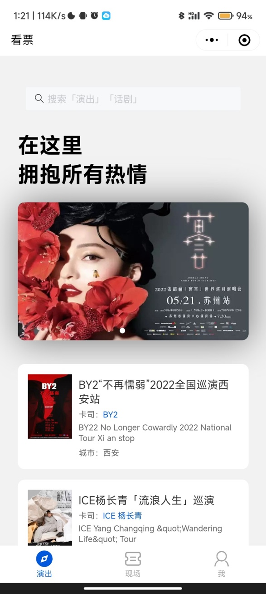
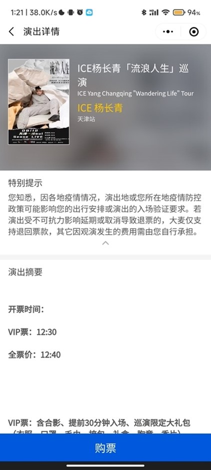
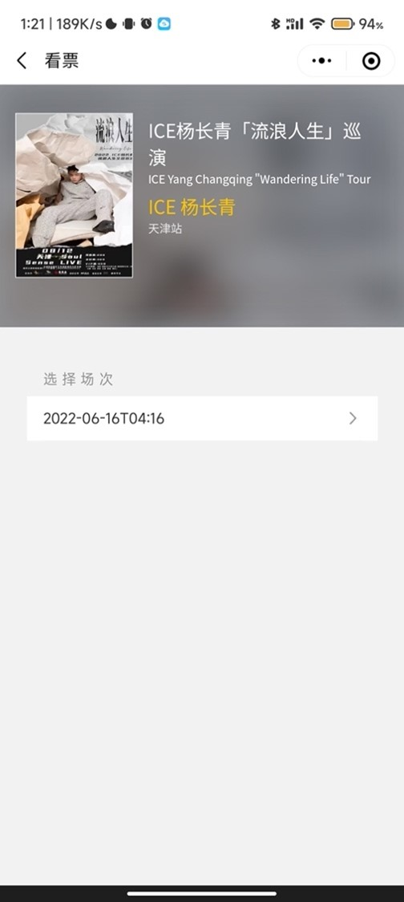
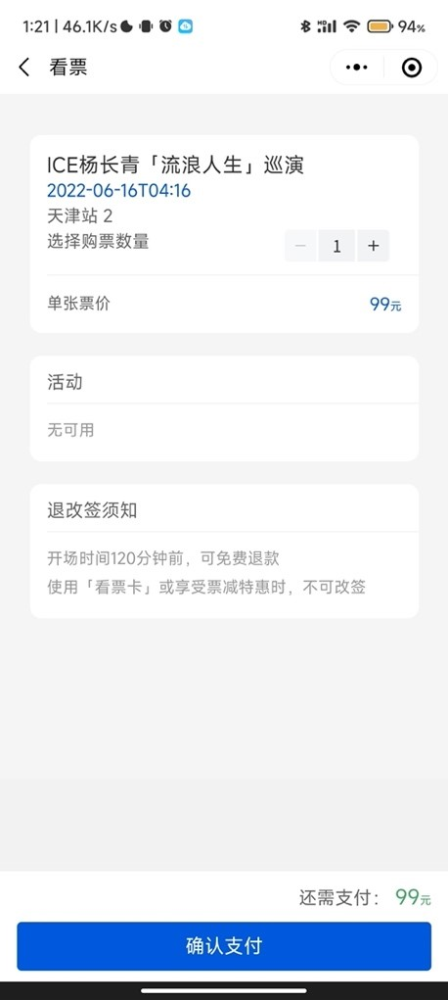
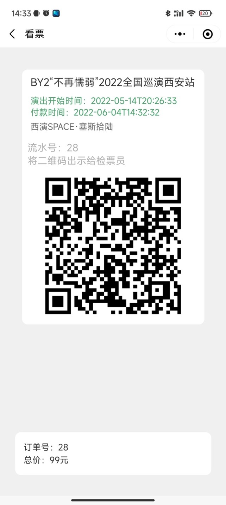
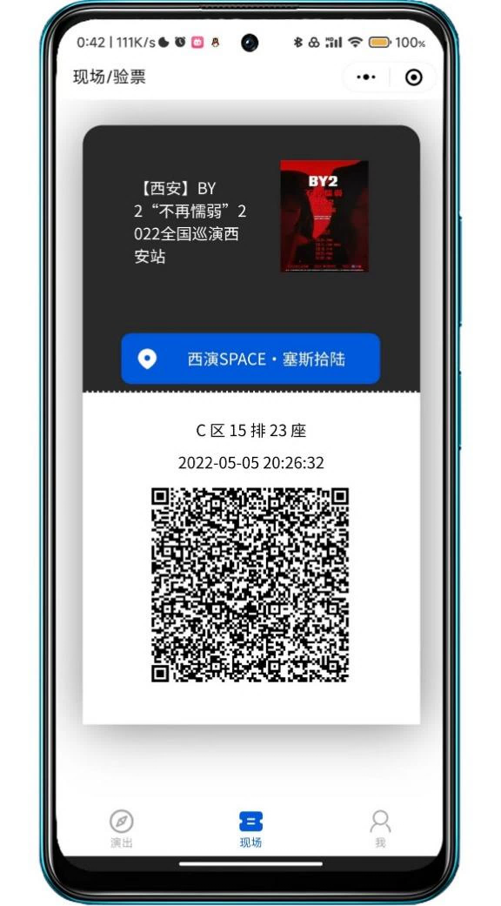
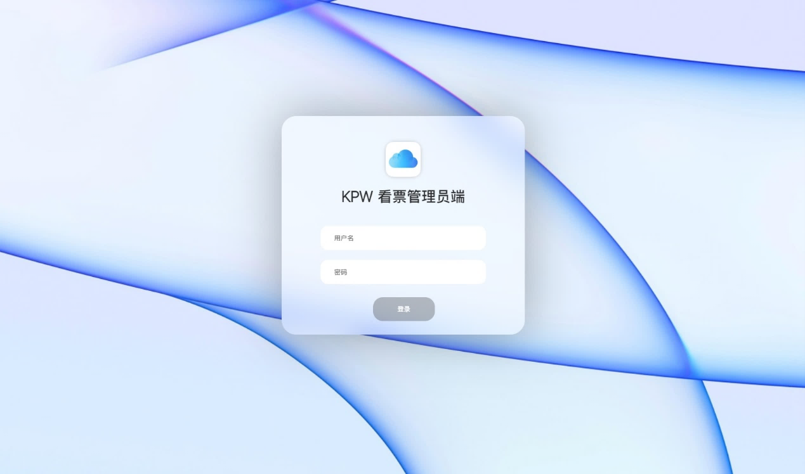

<h1 align="center">🎫 看票 Kanpiao</h1>
<h3 align="center">一套运行在微信生态的完整票务系统</h3>

<p align="center">
  
  
  
  
  
</p>

---

## 📖 项目简介

**看票 Kanpiao** 是一款开源的微信小程序票务系统，覆盖从演出发布、在线购票到现场核销的完整业务流程。项目采用微信小程序原生框架 + PHP 后端 + MySQL 数据库，支持 Docker 一键部署。

> ⚠️ **仓库迁移公告**：原 `kanpiao-web` 后台仓库已废弃。本项目（`kanpiao`）现已合并前端与后台代码，所有功能统一在此仓库维护。

```
kanpiao/
├── kanpiao-master/          # 微信小程序（用户端 + 检票端）
├── kanpiao-web-master/      # PHP 管理后台 + 微信 API
├── docker-compose.yml       # Docker 一键部署
└── seed_data.sql            # 演出种子数据
```

---

## ✨ 功能一览

### 用户端（微信小程序）

| 功能 | 说明 |
|------|------|
| 🔐 微信登录 | 调用 `wx.login` 获取 openid，JWT 鉴权 |
| 🎭 演出浏览 | 首页展示演出列表，支持轮播图推荐 |
| 📅 场次选择 | 按演出查看可选场次、票价、时间 |
| 🛒 在线购票 | 选择场次 → 填写数量 → 下单 |
| 🎟️ 电子票券 | 购票成功后生成二维码门票 |
| 📋 订单管理 | 查看历史订单、订单详情 |
| ✅ 扫码核销 | 检票员扫码入场，记录核销状态 |
| 💬 客服会话 | 小程序内在线客服 |
| 📤 分享 | 分享演出信息给好友 |

### 管理后台（Web）

| 功能 | 说明 |
|------|------|
| 👥 用户管理 | 查看注册用户、设置检票员权限、封禁 |
| 🎬 演出管理 | 添加 / 编辑 / 删除演出信息 |
| ⏰ 场次管理 | 为演出配置多场次、票价、开售时间 |
| 📦 订单管理 | 查看订单、追踪状态、处理退款 |
| 📊 工作台 | 仪表盘概览 |

---

## 🏗️ 技术架构

```
┌─────────────────────┐     ┌──────────────────────┐
│   微信小程序端        │     │     Web 管理后台       │
│  (原生 + Vant Weapp) │     │  (PHP + Bootstrap 4) │
└─────────┬───────────┘     └──────────┬───────────┘
          │ HTTP/REST                  │ Session
          ▼                            ▼
┌─────────────────────────────────────────────────┐
│              PHP 8.1 + Apache                   │
│  ┌─────────────┐  ┌────────────────────────┐   │
│  │ /function/wx │  │ /pages (管理界面)        │   │
│  │ 小程序 API   │  │ 演出/场次/订单/用户 CRUD  │   │
│  │ JWT 鉴权     │  │ Session 鉴权              │   │
│  └──────┬──────┘  └────────────────────────┘   │
└─────────┼──────────────────────────────────────┘
          │ mysqli
          ▼
┌─────────────────────────────────────────────────┐
│              MySQL 8.0                           │
│  wx_user │ admin_user │ show_item │ show_session │
│  orders │ login │ banner                         │
└─────────────────────────────────────────────────┘
```

| 层级 | 技术选型 |
|------|----------|
| 小程序 UI | 微信原生 + [Vant Weapp](https://vant-ui.github.io/vant-weapp/) 1.10 |
| 后端语言 | PHP 8.1 |
| Web 框架 | 原生 PHP + Bootstrap 4（CDN） |
| 数据库 | MySQL 8.0 |
| 认证方案 | 小程序端 JWT (HS256) / 管理端 Session |
| 部署 | Docker Compose |

### 数据库 ER 图

```
wx_user ──1:N──> orders ──N:1──> show_session ──N:1──> show_item
                         │
                   order_status:
                     0=待检票  1=已检票
                     2=待付款  3=退款中  4=已退款
```

---

## 🚀 快速开始

### 前置条件

- [Docker](https://www.docker.com/) & [Docker Compose](https://docs.docker.com/compose/)
- [微信开发者工具](https://developers.weixin.qq.com/miniprogram/dev/devtools/download.html)（运行小程序）
- 微信小程序 AppID（需注册微信小程序）

### 1. 克隆仓库

```bash
git clone git@github.com:hankzhangcn/kanpiao.git
cd kanpiao
```

### 2. 启动后端服务

```bash
docker-compose up -d
```

服务启动后：
- 管理后台：`http://localhost:8080/pages/login.php`
- 小程序 API：`http://localhost:8080/function/wx/`
- 默认管理员账号：`admin` / `admin123`

### 3. 导入种子数据（可选）

```bash
docker exec -i kanpiao-mysql mysql -u kanpiao -pkanpiao kanpiao < seed_data.sql
```

种子数据包含 12 场演出（薛之谦、周深、凤凰传奇、蔡依林等）及 25 个场次。

### 4. 配置并运行小程序

1. 用微信开发者工具打开 `kanpiao-master/` 目录
2. 修改 `app.js` 中的 `serverUrl` 为你的后端地址（本地开发可使用内网 IP，如 `http://192.168.x.x:8080/`）
3. 填入你的小程序 AppID
4. 编译运行

---

## 📂 项目结构

```
kanpiao/
│
├── README.md                    # 项目主文档（本文件）
├── docker-compose.yml           # Docker Compose 编排
├── seed_data.sql                # 演出种子数据
│
├── kanpiao-master/              # 微信小程序
│   ├── app.js                   # 入口：微信登录 + 全局配置
│   ├── app.json                 # 路由 + TabBar 配置
│   ├── pages/
│   │   ├── index/               # 首页 - 演出列表
│   │   ├── now/                 # 现场 - 可入场场次
│   │   ├── my/                  # 我的 - 个人中心
│   │   ├── show_detail/         # 演出详情
│   │   ├── select_session/      # 场次选择
│   │   ├── buy/                 # 购票下单
│   │   ├── buy_ok/              # 购票成功
│   │   ├── orders/              # 订单列表
│   │   ├── order_detail/        # 订单详情（含二维码）
│   │   ├── checker_page/        # 检票扫码
│   │   └── about/               # 关于
│   └── utils/                   # 工具函数
│
└── kanpiao-web-master/          # PHP 后端
    ├── Dockerfile               # PHP 8.1 + Apache 镜像
    ├── kanpiao.sql              # 数据库建表脚本
    ├── index.php                # 入口 → 跳转登录
    ├── pages/                   # Web 管理页面
    │   ├── login.php            # 登录
    │   ├── dashboard.php        # 工作台
    │   ├── menage.php           # 用户管理
    │   ├── show_menage.php      # 演出管理
    │   ├── session_menage.php   # 场次管理
    │   └── order_menage.php     # 订单管理
    ├── function/
    │   ├── wx/                  # 小程序 API（20 个接口）
    │   │   ├── login.php        # 微信登录
    │   │   ├── new_order.php    # 创建订单
    │   │   ├── check_in.php     # 检票入场
    │   │   └── ...
    │   ├── web/                 # 后台鉴权
    │   └── pub/                 # 数据库连接 / JWT
    └── component/               # 公共组件
```

---

## 📸 界面截图

| 首页 | 演出详情 | 场次选择 |
|:---:|:---:|:---:|
|  |  |  |

| 下单 | 订单详情 | 扫码核销 |
|:---:|:---:|:---:|
|  |  |  |

| 管理后台登录 | 工作台 |
|:---:|:---:|
|  | 管理界面 |

---

## 🔑 默认账号

| 角色 | 账号 | 密码 | 说明 |
|------|------|------|------|
| 管理员 | `admin` | `admin123` | Web 后台管理 |

> ⚠️ 密码以 MD5 存储，生产环境建议升级为 bcrypt。

---

## 🔗 API 接口

小程序 API 统一在 `function/wx/` 下：

| 接口 | 方法 | 说明 |
|------|------|------|
| `login.php` | GET | 微信登录，返回 JWT |
| `get_show_list.php` | GET | 获取演出列表（分页） |
| `get_show_detail.php` | GET | 获取演出详情 |
| `get_session_list.php` | GET | 获取场次列表 |
| `new_order.php` | POST | 创建订单 |
| `get_user_orders_list.php` | GET | 用户订单列表 |
| `get_user_orders_detail.php` | GET | 订单详情 |
| `check_in.php` | POST | 检票核销 |
| `check_out.php` | POST | 撤销核销 |

---

## 🤝 参与贡献

欢迎提交 Issue 和 Pull Request。以下是贡献流程：

1. Fork 本仓库
2. 创建特性分支：`git checkout -b feature/xxx`
3. 提交修改：`git commit -m 'feat: xxx'`
4. 推送分支：`git push origin feature/xxx`
5. 创建 Pull Request

---

## 📄 许可证

本项目基于 [MIT License](LICENSE) 开源。

---

<p align="center">
  <sub>Made with ❤️ by <a href="https://github.com/hankzhangcn">Hank</a></sub>
</p>
